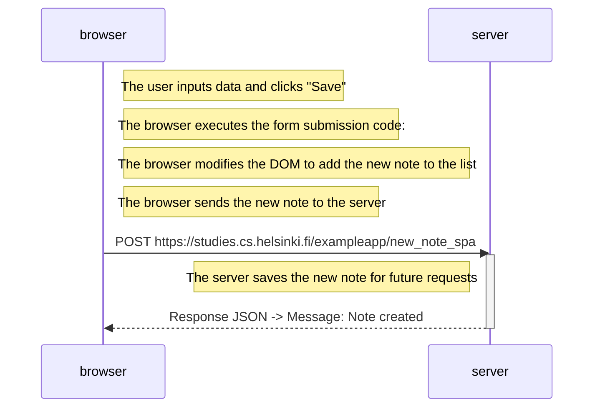

```mermaid
    sequenceDiagram
        participant browser
        participant server

        Note right of browser: The user inputs data and clicks "Save"
        Note right of browser: The browser executes the form submission code:
        Note right of browser: The browser modifies the DOM to add the new note to the list
        Note right of browser: The browser sends the new note to the server
        browser->>server: POST https://studies.cs.helsinki.fi/exampleapp/new_note_spa
        activate server
        Note left of server: The server saves the new note for future requests
        server-->>browser: Response JSON -> Message: Note created
        deactivate server
```
